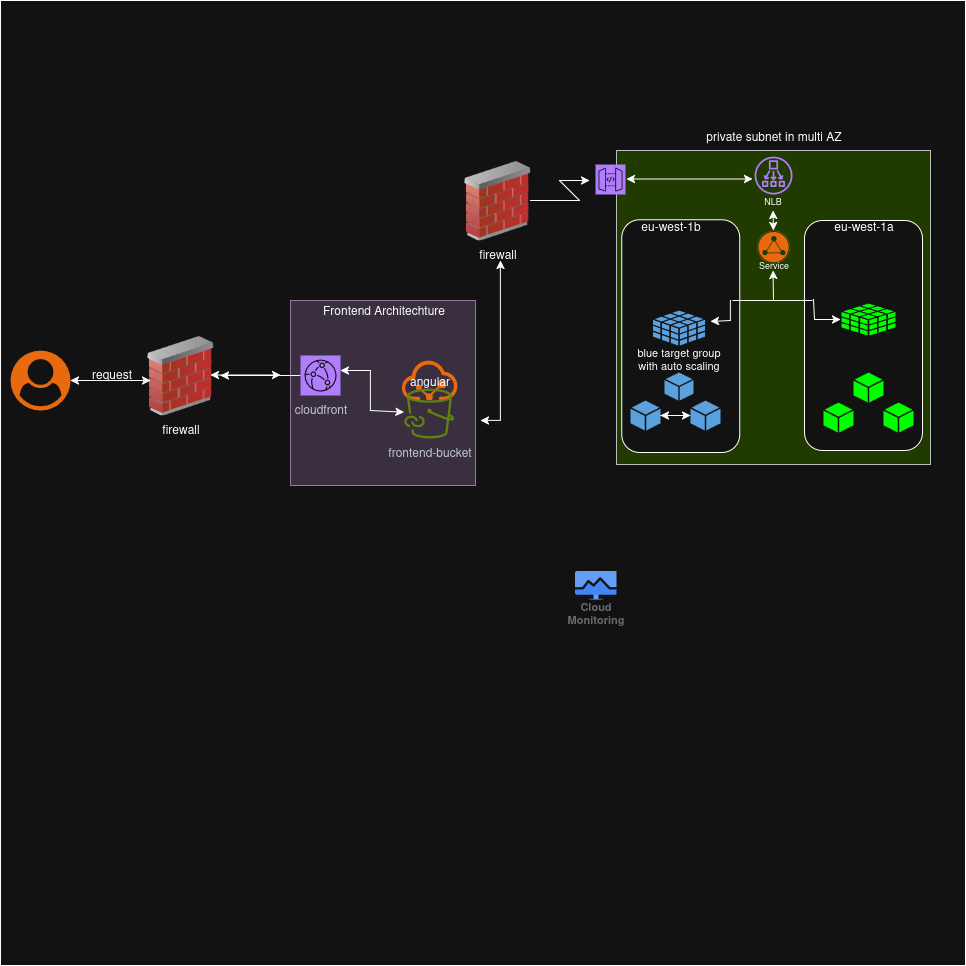

# Terraform Infrastructure as Code Repository

This repository contains Terraform configurations for managing infrastructure across multiple environments (development, staging, and production) using a modular approach. The structure is designed to promote reusability, scalability, and maintainability for cloud infrastructure deployments on AWS.

## Table of Contents
- [Overview](#overview)
- [Directory Structure](#directory-structure)
- [Prerequisites](#prerequisites)
- [Setup Instructions](#setup-instructions)
- [Usage](#usage)
- [Modules](#modules)
- [Environments](#environments)
- [Contributing](#contributing)
- [License](#license)

## Overview
This project uses Terraform to define and manage infrastructure as code (IaC) for a cloud-based application. It organizes resources into reusable modules for backend, frontend, and monitoring components, with separate configurations for development (`dev`), staging (`staging`), and production (`prod`) environments. The modular structure ensures consistency and simplifies updates across environments.

## Directory Structure
The repository is organized as follows:

```
.
├── environments
│   ├── dev
│   │   ├── main.tf
│   │   ├── outputs.tf
│   │   ├── terraform.tfvars
│   │   └── variables.tf
│   ├── prod
│   │   ├── main.tf
│   │   ├── outputs.tf
│   │   ├── terraform.tfvars
│   │   └── variables.tf
│   └── staging
├── media
│   └── architecture.png
├── modules
│   ├── backend
│   │   ├── api_gateway
│   │   ├── database
│   │   ├── ecr
│   │   ├── ecs
│   │   ├── networking
│   │   └── waf
│   ├── frontend
│   │   ├── cloudfront
│   │   ├── random_id
│   │   ├── Readme.md
│   │   ├── s3
│   │   └── waf
│   ├── monitoring
│   │   ├── alarms.tf
│   │   ├── dashboard.tf
│   │   ├── iam.tf
│   │   ├── outputs.tf
│   │   └── variables.tf
│   └── README.md
├── Readme.md
└── Runner.md

```

- **environments/**: Contains environment-specific configurations (`dev`, `staging`, `prod`).
- **modules/**: Reusable Terraform modules for backend, frontend, and monitoring components.
- **Readme.md**: This file, providing an overview of the repository.
- **Runner.md**: Documentation for CI/CD pipeline setup (e.g., GitHub Actions).

### Architecture




## Prerequisites
To use this repository, ensure you have the following installed:
- [Terraform](https://www.terraform.io/downloads.html) (version >= 1.5.0)
- [AWS CLI](https://aws.amazon.com/cli/) (configured with appropriate credentials)
- An AWS account with permissions to manage resources (e.g., IAM, S3, ECS, CloudFront)
- Optional: A CI/CD tool like GitHub Actions for automated deployments (see `Runner.md`)

## Setup Instructions
1. **Clone the Repository**:
   ```bash
   git clone https://github.com/kryotech-123/kanban-task-manager-infra
   cd kanban-task-manager-infra
   ```

2. **Configure AWS Credentials**:
   Ensure your AWS credentials are set up via the AWS CLI or environment variables:
   ```bash
   aws configure
   ```

3. **Initialize Terraform**:
   Navigate to the desired environment directory (e.g., `environments/dev`) and initialize Terraform:
   ```bash
   cd environments/dev
   terraform init
   ```

4. **Customize Variables**:
   Update `terraform.tfvars` in the environment directory with your specific values (e.g., AWS region, resource names).

## Usage
1. **Plan Infrastructure**:
   From the environment directory, generate an execution plan:
   ```bash
   terraform plan
   ```

2. **Apply Infrastructure**:
   Apply the configuration to create or update resources:
   ```bash
   terraform apply
   ```

3. **Destroy Infrastructure** (if needed):
   To remove all resources managed by Terraform:
   ```bash
   terraform destroy
   ```

4. **Module Usage**:
   - Modules in `modules/` are referenced in environment `main.tf` files.
   - Modify `variables.tf` and `terraform.tfvars` to customize module behavior.

## Modules
The repository includes the following Terraform modules:

- **backend/**:
  - `api_gateway`: Configures AWS API Gateway for REST APIs.
  - `database`: Manages database resources (e.g., RDS, DynamoDB).
  - `ecr`: Sets up Elastic Container Registry for Docker images.
  - `ecs`: Configures Elastic Container Service for container orchestration.
  - `networking`: Defines VPC, subnets, and networking components.
  - `waf`: Implements Web Application Firewall rules.

- **frontend/**:
  - `cloudfront`: Configures AWS CloudFront for content delivery.
  - `random_id`: Generates unique identifiers for resources.
  - `s3`: Manages S3 buckets for static content.
  - `waf`: Implements WAF rules for frontend protection.

- **monitoring/**:
  - `alarms.tf`: Defines CloudWatch alarms for resource monitoring.
  - `dashboard.tf`: Creates CloudWatch dashboards for observability.
  - `iam.tf`: Manages IAM roles and policies for monitoring.
  - `logging.tf`: Configures logging for application and infrastructure.

Each module includes `main.tf` (resource definitions), `variables.tf` (input variables), and `outputs.tf` (output values). Some modules include a `Readme.md` with specific details.

## Environments
The repository supports three environments:
- **dev**: Development environment for testing and experimentation.
- **staging**: Staging environment for pre-production testing.
- **prod**: Production environment for live applications.

Each environment directory contains:
- `main.tf`: Core Terraform configuration referencing modules.
- `variables.tf`: Environment-specific variable definitions.
- `terraform.tfvars`: Environment-specific variable values.
- `outputs.tf`: Outputs for retrieving resource information.

## Contributing
Contributions are welcome! To contribute:
1. Fork the repository.
2. Create a feature branch (`git checkout -b feature/your-feature`).
3. Commit your changes (`git commit -m "Add your feature"`).
4. Push to the branch (`git push origin feature/your-feature`).
5. Open a pull request with a detailed description of your changes.

Please ensure your code follows Terraform best practices and includes appropriate documentation.

## License
This project is licensed under the MIT License. See the [LICENSE](LICENSE) file for details.

