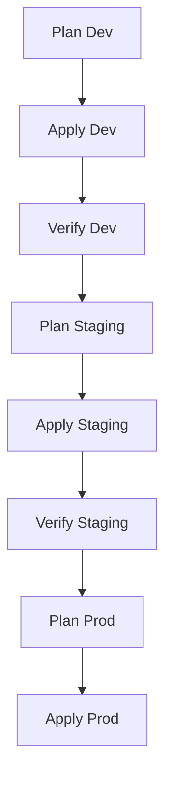

# Kanban Task Manager - Infrastructure Documentation

## Table of Contents
1. [Project Overview](#project-overview)
2. [Architecture](#architecture)
3. [Infrastructure Components](#infrastructure-components)
4. [Environment Strategy](#environment-strategy)
5. [Module Reference](#module-reference)
6. [Deployment Workflow](#deployment-workflow)
7. [Monitoring & Observability](#monitoring--observability)
8. [Security Framework](#security-framework)
9. [Getting Started](#getting-started)
10. [Operational Procedures](#operational-procedures)

## Project Overview

This documentation covers the infrastructure implementation for a Kanban Task Manager system, built using AWS services and managed through Terraform. The infrastructure supports a modern web application with separate frontend and backend components.

## Architecture

![Architecture Diagram]
*(Visual representation would show: CloudFront → S3 (frontend) → API Gateway → ECS (backend) → Database, with monitoring components)*

Key Characteristics:
- **Multi-environment** (dev/staging/prod) deployment capability
- **Infrastructure as Code** with Terraform modules
- **Decoupled components** for independent scaling
- **Security-first** design with WAF and network isolation

## Infrastructure Components

### Core Services
- **Frontend**: S3 + CloudFront CDN
- **Backend**: ECS Fargate services
- **API Layer**: API Gateway
- **Data Layer**: Managed database (module suggests RDS or DynamoDB)
- **Networking**: VPC with public/private subnets

### Supporting Services
- **Container Registry**: ECR
- **Security**: Web Application Firewall (WAF)
- **Monitoring**: CloudWatch alarms and dashboards

## Environment Strategy

Three distinct environments maintained through Terraform:

| Environment | Purpose | Branch Policy | Deployment Frequency |
|-------------|---------|---------------|-----------------------|
| **dev**     | Feature development | Feature branches | Multiple times daily |
| **staging** | Integration testing | Main branch | After feature completion |
| **prod**    | Production | Tagged releases | Scheduled deployments |

Each environment has:
- Dedicated Terraform configuration
- Isolated AWS resources
- Environment-specific variables

## Module Reference

### Backend Modules

#### `api_gateway`
- **Purpose**: Manage API Gateway configuration
- **Variables**: 
  - `api_name`, `stage_name`, `lambda_integrations`
- **Outputs**: 
  - `api_endpoint`, `execution_arn`

#### `database`
- **Purpose**: Provision database resources
- **Variables**:
  - `db_engine`, `instance_class`, `storage_gb`
- **Outputs**:
  - `db_endpoint`, `connection_string`

#### `ecr`
- **Purpose**: Container image repositories
- **Variables**:
  - `repository_names`, `image_tag_mutability`
- **Outputs**:
  - `repository_urls`

#### `ecs`
- **Purpose**: Container orchestration
- **Variables**:
  - `service_name`, `task_cpu`, `task_memory`
- **Outputs**:
  - `service_arn`, `task_definition`

#### `networking`
- **Purpose**: VPC and network infrastructure
- **Variables**:
  - `vpc_cidr`, `availability_zones`
- **Outputs**:
  - `vpc_id`, `private_subnets`, `public_subnets`

#### `waf`
- **Purpose**: Web application firewall
- **Variables**:
  - `allowed_ips`, `rate_limit`
- **Outputs**:
  - `waf_acl_arn`

### Frontend Modules

#### `cloudfront`
- **Purpose**: CDN distribution
- **Variables**:
  - `domain_name`, `certificate_arn`
- **Outputs**:
  - `distribution_id`, `domain`

#### `s3`
- **Purpose**: Static website hosting
- **Variables**:
  - `bucket_name`, `index_document`
- **Outputs**:
  - `bucket_arn`, `website_endpoint`

### Monitoring Module
- **Components**:
  - CloudWatch alarms (CPU, memory, errors)
  - Centralized logging
  - IAM roles for monitoring
  - Operational dashboards

## Deployment Workflow

### Infrastructure Provisioning


### Application Deployment
1. **Frontend**:
   - Build artifacts uploaded to S3
   - CloudFront cache invalidation

2. **Backend**:
   - New container images pushed to ECR
   - ECS service updates with new task definition

## Monitoring & Observability

### Key Metrics Tracked
- **Frontend**:
  - 4xx/5xx error rates
  - Cache hit ratio
  - Request latency

- **Backend**:
  - ECS service health
  - API response times
  - Database connections

### Alerting Strategy
- PagerDuty/Slack integration for:
  - Service degradation
  - Resource constraints
  - Security events

## Security Framework

### Infrastructure Security
- WAF rules for OWASP Top 10 protection
- VPC network isolation
- Least privilege IAM policies

### Data Security
- Encryption at rest (AWS KMS)
- Encryption in transit (TLS 1.2+)
- Regular backup verification

### Compliance
- Infrastructure designed to support:
  - SOC 2
  - GDPR
  - HIPAA (with additional configuration)

## Getting Started

### Prerequisites
- Terraform 1.0+
- AWS CLI v2
- AWS account with sufficient permissions
- Backend state storage (S3 + DynamoDB)

### Initial Setup
1. Clone repository
2. Configure backend state:
   ```hcl
   terraform {
     backend "s3" {
       bucket = "your-state-bucket"
       key    = "kanban/dev/terraform.tfstate"
       region = "us-east-1"
     }
   }
   ```
3. Initialize Terraform:
   ```bash
   cd environments/dev
   terraform init
   ```

## Operational Procedures

### Routine Maintenance
- **Monthly**:
  - Terraform version updates
  - Module updates
  - Security patch review

- **Quarterly**:
  - Access key rotation
  - Backup restoration tests

### Incident Response
1. **Detection**: Monitoring alerts
2. **Triage**: Impact assessment
3. **Containment**: WAF rules/auto-scaling
4. **Resolution**: Root cause analysis
5. **Prevention**: Post-mortem actions

### Scaling Operations
- **Frontend**: Adjust CloudFront caching
- **Backend**: ECS auto-scaling policies
- **Database**: Vertical scaling or read replicas
